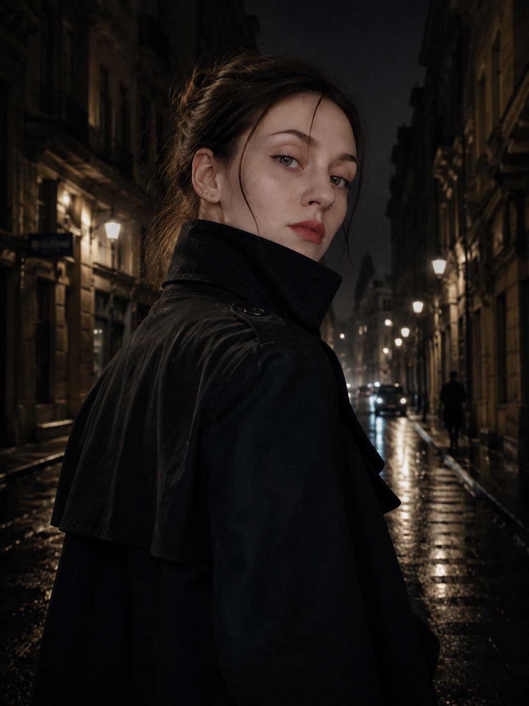

# Досье агента Алёны — сайт-книга на день рождения

Готовый сайт лежит в этой папке. Открыть его можно прямо сейчас — просто откройте `index.html` в браузере.

## Как разместить на GitLab Pages (бесплатно)

1. Создайте новый проект на gitlab.com, например `alyona-birthday`.
2. Загрузите в него всё содержимое этой папки (`index.html`, `css/`, `js/`, `images/`, `audio/`) — можно через веб-интерфейс GitLab (кнопка "Upload File" / перетаскивание) или через git.
3. В корне проекта создайте файл `.gitlab-ci.yml` со следующим содержимым:

```yaml
pages:
  stage: deploy
  script:
    - mkdir .public
    - cp -r * .public
    - mv .public public
  artifacts:
    paths:
      - public
  rules:
    - if: $CI_COMMIT_BRANCH == $CI_DEFAULT_BRANCH
```

4. Подождите пару минут, пока пройдёт CI/CD (Settings → CI/CD → Pipelines).
5. Ссылка на сайт появится в Settings → Pages, обычно вида `https://<ваш-юзернейм>.gitlab.io/alyona-birthday`.

## Как добавить свои фотографии (сгенерированные нейросетью)

В файле `index.html` есть блоки `<div class="photo-slot">...</div>` в каждой главе и блоки `<div class="gallery-slot">...</div>` в разделе «Снимки». Рядом с каждым — подсказка, что за изображение туда просится (курсивом, мелким шрифтом).

Проще всего:
1. Сгенерируйте изображение по подсказке (ChatGPT/DALL·E, Midjourney — что угодно).
2. Сохраните файл в папку `images/`, например `images/gallery-1.jpg`.
3. В `index.html` замените содержимое нужного `photo-slot` или `gallery-slot` на:
```html

```

Обложка уже использует загруженное вами фото (`images/alyona-dossier-photo.jpg`) — просто замените этот файл на другой с тем же именем, если захотите другой портрет на обложку.

## Как добавить фоновую музыку

Кнопка «фоновая музыка» внизу справа уже работает — не хватает только самого файла.

1. Найдите инструментальный трек без слов (например, на Pixabay Music, YouTube Audio Library или Free Music Archive — там есть треки со свободной лицензией).
2. Сохраните его как `audio/theme.mp3`.
3. Готово — кнопка сама подхватит файл, как только он появится в проекте.

Если файла пока нет, кнопка просто ничего не сыграет (браузер не выдаст ошибку пользователю).

## Раздел «Секретный блокнот»

Отдельная вкладка `notebook` позволяет Алёне писать свои тексты прямо на сайте. Всё сохраняется в браузере (localStorage) — то есть данные останутся, даже если закрыть вкладку и вернуться позже с того же устройства и браузера. Кнопка «Скачать» рядом с каждой записью и «Скачать весь блокнот» сохраняют текст в `.txt`-файл — на случай, если она захочет иметь копию отдельно от сайта (или почистит историю браузера).

⚠️ Важный нюанс: localStorage привязан к конкретному браузеру на конкретном устройстве. Если Алёна откроет сайт с телефона, а потом с ноутбука — это будут две разные "копии" блокнота. Если для дня рождения важно, чтобы записи были доступны отовсюду, дайте знать — можно подключить простое общее хранилище.

## Структура файлов

```
index.html          — вся разметка и текст
css/style.css        — стили и цветовая палитра "досье"
js/script.js          — навигация, эффект "рассекречивания", музыка, блокнот
images/               — фотографии (уже лежит одна ваша)
audio/                — сюда положить theme.mp3
```

С днём рождения Алёне! 🎂
